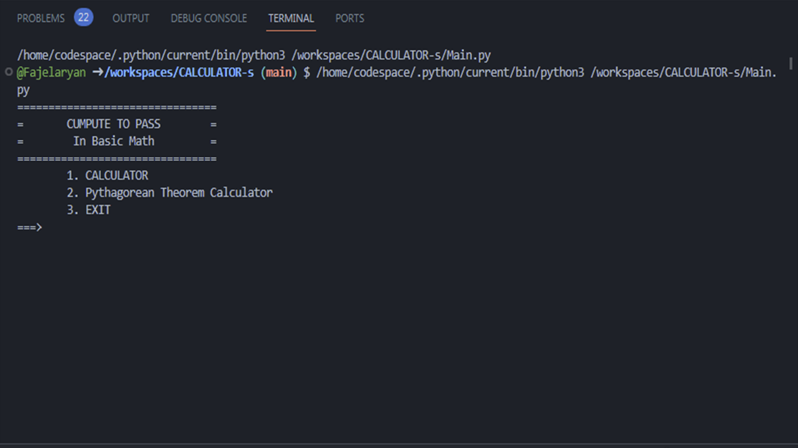
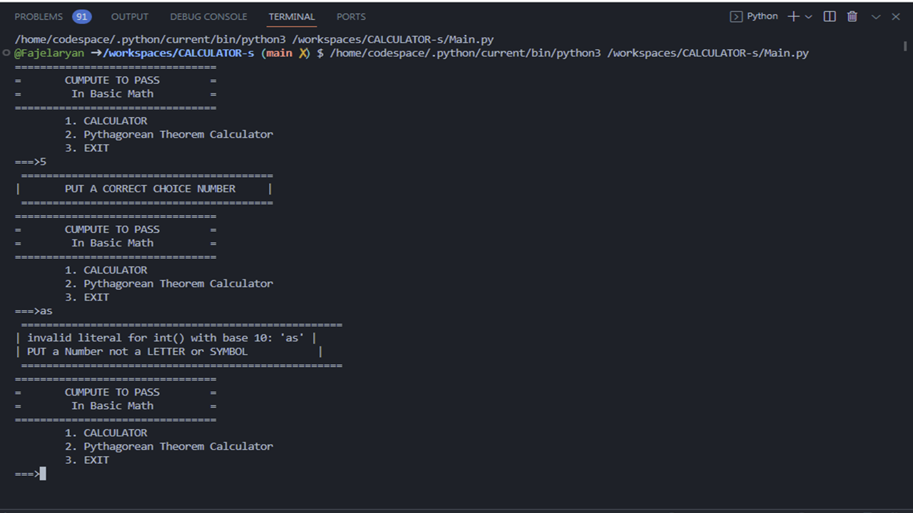
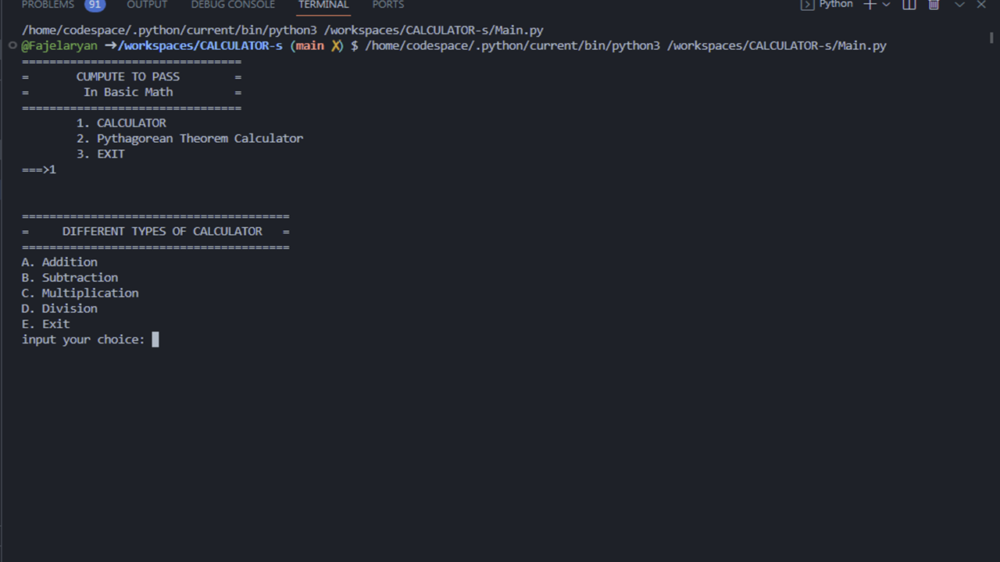
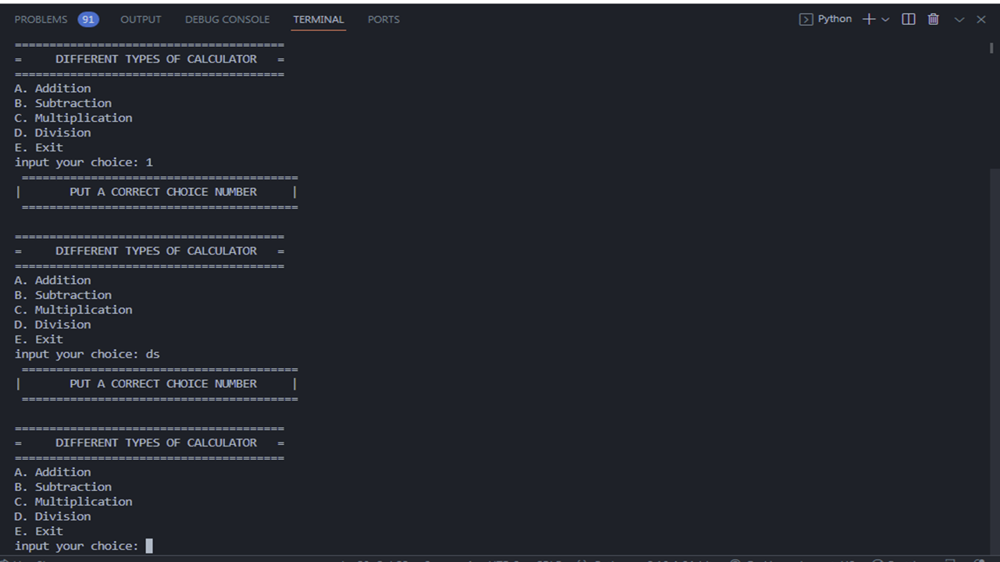
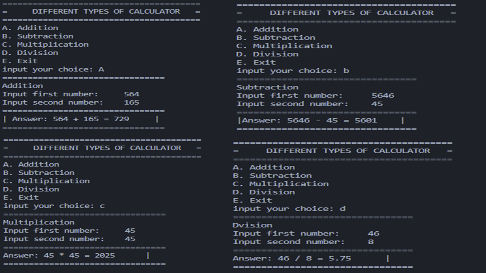
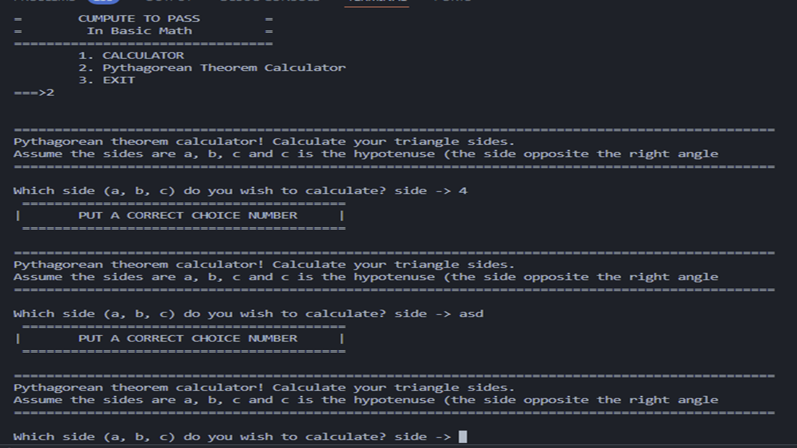
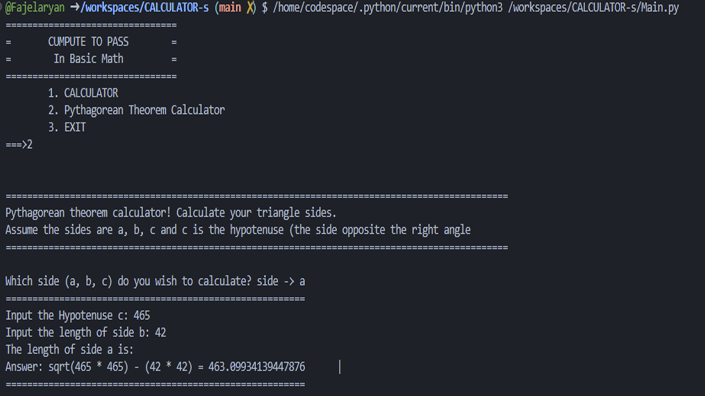
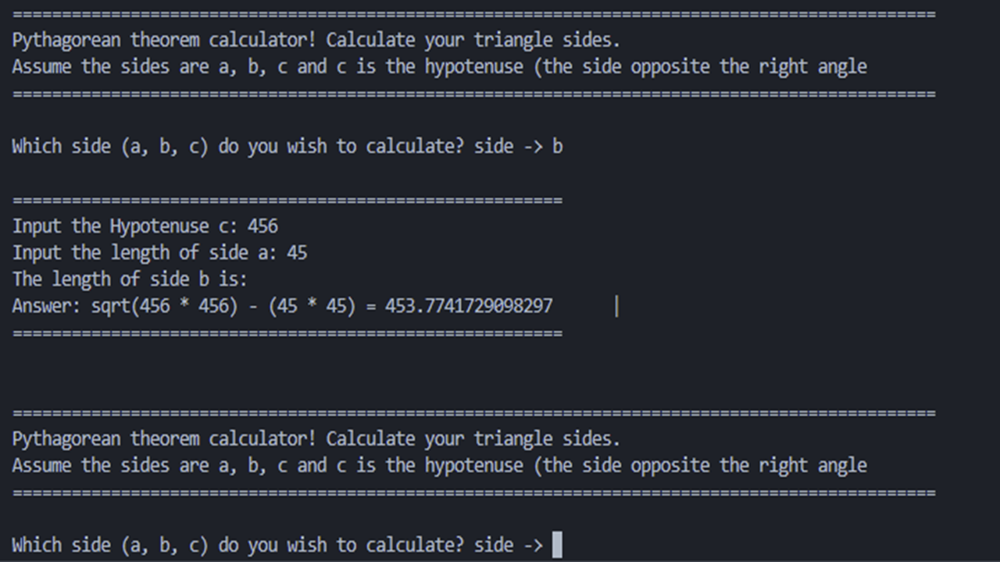
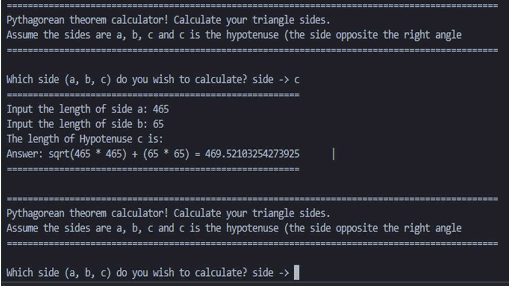

# CALCULATOR

A program that performs arithmetic operations on numbers. Basic calculators can do only addition, subtraction, multiplication and division mathematical calculations.

Pythagoras theorem states that “In a right-angled triangle, the square of the hypotenuse side is equal to the sum of squares of the other two sides“. The sides of this triangle have been named Perpendicular, Base and Hypotenuse. Here, the hypotenuse is the longest side, as it is opposite to the angle 90°.

This project is used to performed a calculation :
- Addition
- Subtraction
- Multiplications
- Division
- Pythagorean Theorem

##  Unified Modeling Language (UML)

## SCREEN SHOT

## Authors

- [Fajelaryan](https://github.com/Fajelaryan)
- [@FruitJess04](https://github.com/FruitJess04)
- [@frueldaethel](https://github.com/frueldaethel)
- [@Johnlord01](https://github.com/Johnlord01)

